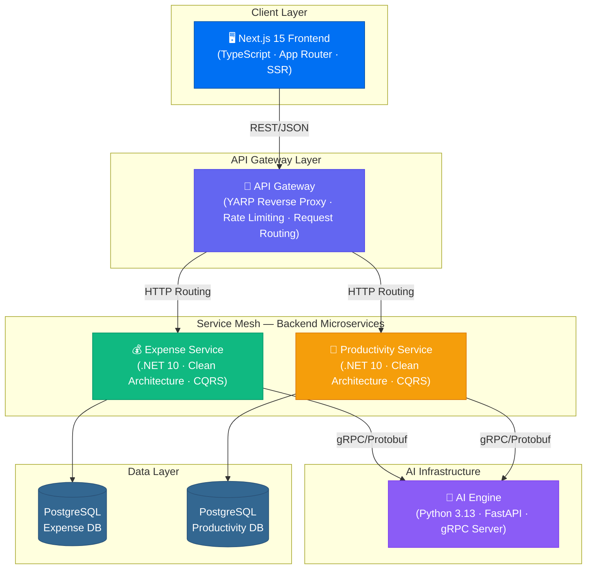

# 🧠 Self-Orbit — Personal Intelligence Platform

<div align="center">

[](https://dotnet.microsoft.com/)
[](https://python.org)
[](https://nextjs.org)
[](https://grpc.io)
[](https://postgresql.org)
[](https://docker.com)
[](https://kubernetes.io)

**Cloud-native, event-driven microservice platform for personal intelligence.**

*Transforms unstructured text and audio into structured, actionable data—powered by AI inference, gRPC inter-service communication, and a horizontally scalable Kubernetes-ready architecture.*

</div>

---

## 🏗️ System Architecture



---

## ⚡ Tech Stack & Engineering Principles

| Layer | Technology | Patterns & Practices |
|-------|-----------|---------------------|
| **Frontend** | Next.js 15, TypeScript (strict), React Server Components | Server-first rendering, optimistic UI, typed API clients |
| **API Gateway** | .NET 10, YARP | Centralized routing, request aggregation, API versioning |
| **Backend Services** | .NET 10, EF Core, LiteBus, FluentValidation | Clean Architecture, CQRS, DDD, Vertical Slice, Repository + UoW |
| **AI Engine** | Python 3.13, FastAPI, gRPC, Pydantic v2 | Pipeline-based processing, async-first, schema validation |
| **Communication** | gRPC (inter-service), REST/JSON (client-facing) | Protobuf contracts, retry policies, circuit breakers |
| **Data** | PostgreSQL, EF Core Migrations | DB-per-service, no lazy loading, explicit transactions |
| **Observability** | Serilog, structured JSON logging | Correlation IDs, distributed tracing readiness |
| **Containerization** | Docker, Docker Compose | Multi-stage builds, health checks, network isolation |
| **Orchestration** | Kubernetes manifests | Deployments, Services, StatefulSets, ConfigMaps, HPA-ready |
| **Testing** | xUnit, FluentAssertions, Moq, pytest, pytest-asyncio | Unit · Integration · Contract tests across all layers |

### 🎯 Architectural Pillars

- **12-Factor App Compliance** — environment-driven configuration, stateless services, port binding, dev/prod parity
- **Domain-Driven Design** — bounded contexts, aggregate roots, value objects, domain events
- **CQRS** — command/query segregation with dedicated handlers, no business logic in controllers
- **Clean Architecture** — framework-independent domain, dependency inversion at every boundary
- **Cloud-Native** — container-first, horizontally scalable, orchestration-ready with Kubernetes
- **Contract-First APIs** — Protobuf for service communication, OpenAPI for client-facing endpoints

---

## 📦 Monorepo Structure

```text
self-orbit/
│
├── ai-infrastructure/         # 🧠 Python FastAPI + gRPC AI engine
│   ├── app/
│   │   ├── grpc/              #    Async gRPC server & handlers
│   │   ├── api/               #    REST fallback endpoints
│   │   ├── services/          #    NLP processing services
│   │   ├── pipelines/         #    Composable processing pipelines
│   │   ├── models/            #    Pydantic v2 schemas
│   │   └── core/              #    Config, logging, exceptions
│   └── tests/                 #    pytest + gRPC contract tests
│
├── backend/                   # ⚙️ .NET 10 microservices
│   ├── gateway/               #    YARP API Gateway
│   ├── services/
│   │   ├── expense-service/   #    💰 Financial tracking & budgeting
│   │   └── productivity-service/  📅 Tasks & journal management
│   ├── building-blocks/       #    Shared domain/application/infra
│   ├── tests/                 #    xUnit test projects
│   └── openapi/               #    OpenAPI specifications
│
├── frontend/                  # 🖥️ Next.js 15 TypeScript app
│   ├── app/                   #    App Router pages
│   ├── components/            #    Reusable UI components
│   ├── services/              #    Typed API service layer
│   └── types/                 #    TypeScript interfaces
│
├── contracts/                 # 🔗 Shared Protobuf definitions
│   └── proto/                 #    gRPC service contracts
│
├── k8s/                       # ☸️ Kubernetes manifests
├── docs/                      # 📘 Architecture & ADRs
├── scripts/                   # 🔧 Build & dev automation
├── nx.json                    # ⚙️ Nx Workspace configuration
├── docker-compose.yml         # 🐳 Local orchestration
└── docker-compose.override.yml
```

---

## 🚀 Quick Start

### Prerequisites

- [.NET 10 SDK](https://dotnet.microsoft.com/download)
- [Python 3.13+](https://python.org)
- [Node.js 20+](https://nodejs.org)
- [Docker & Docker Compose](https://docker.com)
- [Protocol Buffers Compiler](https://grpc.io/docs/protoc-installation/)

### Local Development (via Nx)

This repository uses **Nx** to orchestrate tasks across Python, .NET, and Next.js.

```bash
# Clone the repository
git clone https://github.com/yourusername/self-orbit.git
cd self-orbit

# Install Nx & dependencies
npm install

# Start infrastructure (PostgreSQL)
docker-compose up -d postgres-expense postgres-productivity

# Generate protobuf stubs
./scripts/generate-protos.ps1

# Start the full stack locally via Nx
npm run dev:ai            # Starts Python AI Engine
npm run dev:frontend      # Starts Next.js app
# (Run .NET services through Visual Studio / Rider, or dotnet cli)

# Visualize workspace dependencies
npm run graph
```

### Docker Compose (Full Stack)

```bash
docker-compose up --build
```

### Running Tests (via Nx)

```bash
# Run tests for all projects across all languages
npm run test:all

# Run tests only for projects affected by your current changes
npm run affected:test
```

### Building Projects

```bash
# Build all projects in the correct dependency order
npm run build:all

# Build only affected projects
npm run affected:build
```

---

## 🔗 Service Communication

| Route | Protocol | Description |
|-------|----------|-------------|
| `Frontend → Gateway` | REST/JSON | All client-facing API calls |
| `Gateway → Expense Service` | HTTP | Request routing via YARP |
| `Gateway → Productivity Service` | HTTP | Request routing via YARP |
| `Expense Service → AI Engine` | gRPC/Protobuf | Expense parsing & categorization |
| `Productivity Service → AI Engine` | gRPC/Protobuf | Task parsing, transcription, summarization |

---

## 📊 API Endpoints

### Expense Service
| Method | Endpoint | Description |
|--------|----------|-------------|
| `POST` | `/api/v1/expenses` | Create expense (triggers AI parsing) |
| `GET` | `/api/v1/expenses` | List expenses with filters |
| `GET` | `/api/v1/expenses/{id}` | Get expense by ID |
| `POST` | `/api/v1/budgets` | Set budget for category/period |
| `GET` | `/api/v1/budgets` | List active budgets |

### Productivity Service
| Method | Endpoint | Description |
|--------|----------|-------------|
| `POST` | `/api/v1/tasks` | Create task (triggers AI parsing) |
| `GET` | `/api/v1/tasks` | List tasks with filters |
| `PATCH` | `/api/v1/tasks/{id}/status` | Transition task state |
| `POST` | `/api/v1/journal` | Create journal entry |
| `POST` | `/api/v1/journal/audio` | Upload audio for transcription |
| `GET` | `/api/v1/journal` | List journal entries |

---

## ☸️ Kubernetes Deployment

```bash
# Apply all manifests
kubectl apply -f k8s/namespace.yaml
kubectl apply -f k8s/ --recursive

# Verify deployments
kubectl get pods -n self-orbit
kubectl get services -n self-orbit
```

---

## 📄 License

This project is licensed under the MIT License — see the [LICENSE](LICENSE) file for details.

---

<div align="center">
  <sub>Built with ❤️ as a showcase of enterprise-grade microservice architecture, cloud-native engineering, and full-stack AI integration.</sub>
</div>
